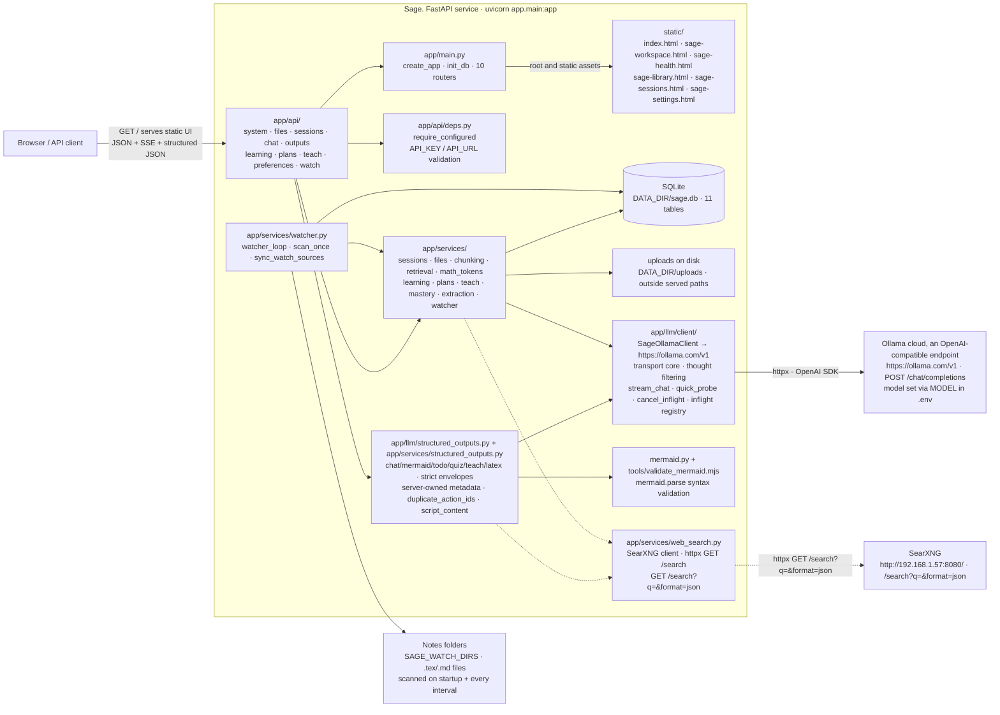
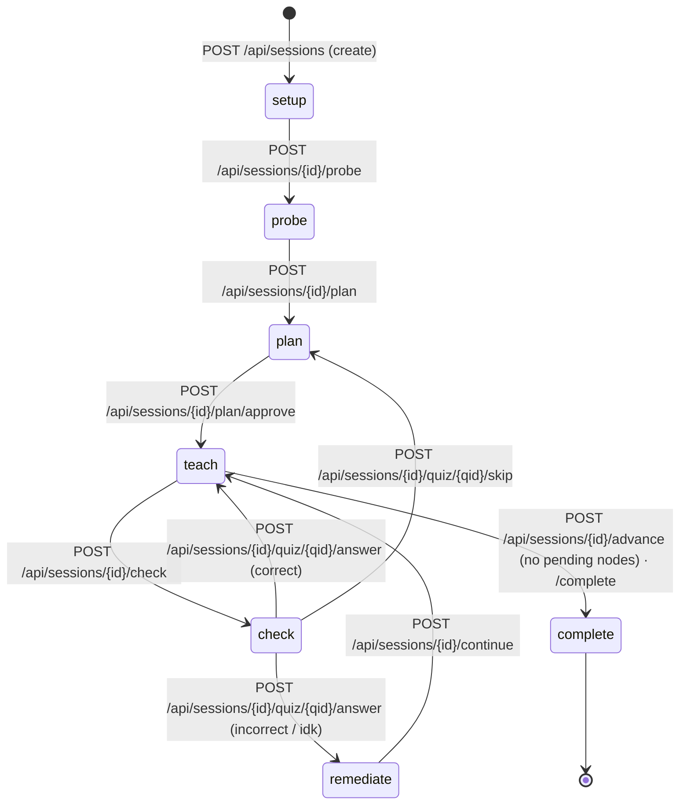
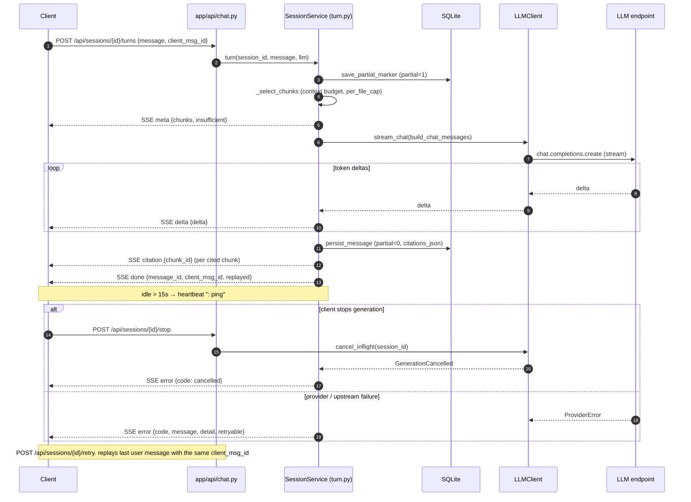
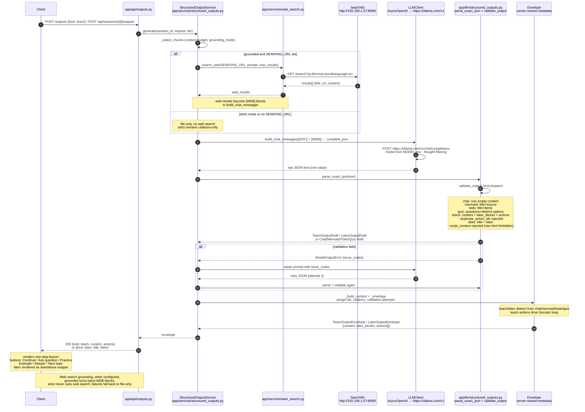
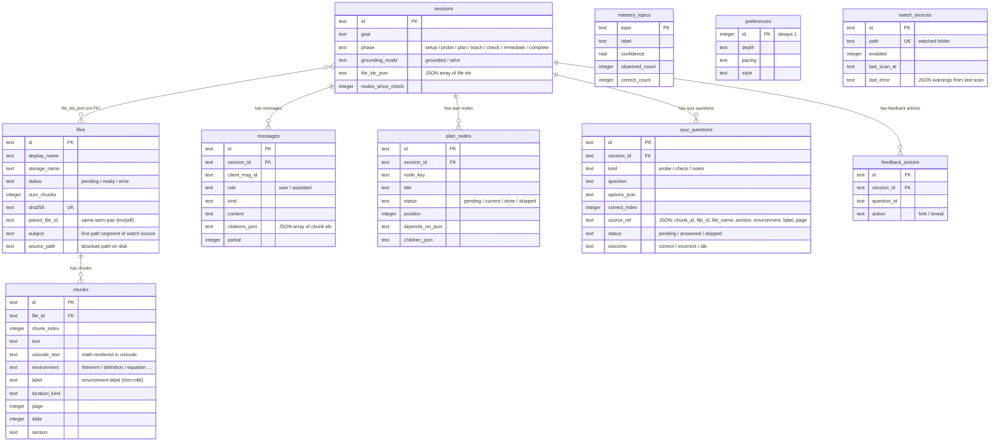

> **This project is not complete.** Sage is under active development and has rough
> edges. Things that are still being built or are known to be unfinished include:
> the PDF source viewer (currently a collapsible side rail, still being polished),
> in-text citation rendering, the automatic diagnostic probe that opens a session,
> the plan-building and re-teaching flow, LaTeX rendering in every card, and the
> final-quiz and grading loop. The UI changes often and the learning arc is still
> being tuned. Expect breaking changes.

## Summary

Sage is a local-first web app that works as a personal AI tutor. Attach study files (PDF, DOCX, PPTX, Markdown, LaTeX, text) or point it at a notes folder it watches on its own, and Sage chunks them, probes what you already know, builds a learning plan, teaches each topic, then runs a final quiz and re-teaches whatever did not stick. All of this happens through a grounded, streaming chat that cites the exact excerpts it used. The Python 3.11 FastAPI service serves the static UI from `/` alongside JSON and SSE endpoints, talks to an OpenAI-compatible endpoint (any Ollama model set via `MODEL`), can search the web via SearXNG when `SEARXNG_URL` is set, and keeps everything in SQLite plus files under `DATA_DIR` (default `~/.local/share/sage`), with uploads stored outside any served path.

## Project structure

```
sage/
├── app/
│   ├── main.py                      # FastAPI app factory · init_db · 10 routers
│   ├── config.py                    # Settings (API_URL / API_KEY / MODEL + SEARXNG_URL / HOST / PORT / limits, read from .env)
│   ├── db.py                        # SQLite schema v2 · connection helpers
│   ├── models.py                    # Pydantic request/response models
│   ├── errors.py                    # error envelope + exception handlers
│   ├── sse.py                       # SSE helper (15s heartbeat · sse_response)
│   ├── logging_setup.py             # logging configuration
│   ├── util.py                      # id / utc_now helpers
│   ├── api/                         # HTTP routers
│   │   ├── deps.py                  #   require_configured · handle_value_error
│   │   ├── system.py                #   GET /api/health
│   │   ├── files.py                 #   /api/files upload · list · excerpts · retry · delete
│   │   ├── sessions.py              #   /api/sessions CRUD · select files · grounding
│   │   ├── chat.py                  #   /turns · /retry (SSE) · /stop
│   │   ├── outputs.py               #   /outputs structured chat · Mermaid · todo · quiz
│   │   ├── learning.py              #   /probe · /check · /notes-quiz · quiz answer
│   │   ├── plans.py                 #   /plan generate · approve · reorder · skip · expand · regenerate · select
│   │   ├── teach.py                 #   /advance · /continue · /complete · quiz hint/reveal/skip
│   │   ├── watch.py                 #   /api/watch list · add · scan · delete
│   │   └── preferences.py           #   /api/preferences · /api/mastery reset
│   ├── llm/
│   │   ├── client/                # Ollama client package (split from client.py)
│   │   │   ├── core.py            # SageOllamaClient · degradation ladder · stream/chat paths
│   │   │   ├── config.py          # OllamaClientConfig + API_URL/API_KEY/MODEL mapping
│   │   │   ├── attempt.py         # ChatAttempt (bread-parity)
│   │   │   ├── leak_guard.py      # _strip_leaked_calls (gemma leaked-call guard)
│   │   │   ├── utils.py           # SDK value coercion · unsupported-feature detection
│   │   │   ├── api_deps.py        # get_llm_client · reset_llm_client · _strip_thought
│   │   │   └── __init__.py        # re-exports public surface
│   │   ├── tools/                 # Tool schema + dispatch package (split from tools.py)
│   │   │   ├── schemas.py         # TOOL_SCHEMAS · available_tools
│   │   │   ├── actions.py         # tool handler implementations
│   │   │   ├── dispatch.py        # execute_tool · _dispatch_tool
│   │   │   └── __init__.py        # re-exports available_tools · execute_tool
│   │   ├── messages.py              # chat message builder · hybrid Socratic tutor + [WEB] blocks · citation markers
│   │   ├── notes.py                 # notes-quiz generation · answerability check
│   │   ├── structured.py            # structured probe/plan question requests
│   │   └── structured_outputs.py     # exact JSON decoding · bounded repair · validation · teach/latex
│   └── services/
│       ├── sessions/                # session state machine package
│       │   ├── __init__.py          #   SessionService export
│       │   ├── session.py           #   PHASES · CRUD · select_files · grounding
│       │   ├── turn.py              #   SSE turn/retry stream generators
│       │   └── rows.py              #   plan node / quiz question row mappers
│       ├── files.py                 # upload · storage · chunk persistence · pairing
│       ├── chunking.py              # CHUNK_CHARS / CHUNK_OVERLAP splitter
│       ├── retrieval.py             # context-budget chunk selection
│       ├── math_tokens.py           # math-aware tokenizer (Greek · LaTeX · unicode)
│       ├── learning.py              # probe/check/notes generation · quiz grading
│       ├── plans.py                 # plan generate/approve/reorder/skip/expand
│       ├── teach.py                 # advance/continue/complete · hint/reveal
│       ├── mastery.py               # mastery_topics confidence tracking
│       ├── watcher.py               # notes folder watcher (scan loop · watch_sources)
│       ├── structured_outputs.py     # API-first structured artifact orchestration · teach/latex trio
│       ├── mermaid.py                # Node Mermaid syntax-validation adapter
│       ├── web_search.py             # SearXNG client · httpx GET /search · /search?q=&format=json
│       └── extraction/              # base · pdf · docx · pptx · md · txt · tex → plain text
├── static/                           # browser UI served at `/` by app/main.py
│   ├── index.html                    # home chat and session creation
│   ├── sage-workspace.html            # persisted session workspace
│   ├── sage-health.html               # health dashboard
│   ├── sage-library.html              # file library
│   ├── sage-sessions.html             # session list
│   └── sage-settings.html             # preferences and settings
├── tools/
│   ├── check_wheels.py              # ARM64 wheel preflight check
│   ├── smoke_chat.py                # live endpoint smoke test
│   └── validate_mermaid.mjs         # Node Mermaid syntax validator (mermaid.parse)
├── tests/                           # pytest suite: E2E-first via the API layer (faked LLM)
│   ├── conftest.py
│   ├── fakes/fake_llm.py
│   └── test_*.py                    # API, chunking, retrieval, plans, teach, mastery,
│                                    #   extraction_tex, math_tokens, watcher, notes_quiz…
├── docs/                            # user-facing docs (built into the Quartz site)
│   ├── index.md                     #   landing page
│   ├── setup.md                     #   install · run · LAN access
│   ├── environment.md               #   env var reference
│   ├── ui.md                        #   using the web UI
│   ├── security.md                  #   trusted-network-only + password gate
│   ├── 02-learning-loop.md          #   how Sage teaches
│   └── 08-latex-notes.md            #   LaTeX notes integration
├── run.sh                           # one-command start (Linux/Pi)
├── run.bat                          # one-command start (Windows)
├── requirements.txt
├── package.json                     # Node deps for the Mermaid validator
├── package-lock.json                # pinned npm dependency tree
└── .env.example                     # copy to .env, fill in API_KEY (and MODEL)
```

## Architecture

### System architecture



### Session state machine

Phases live in `app/services/sessions/session.py` (`PHASES = ("setup", "probe", "plan", "teach", "check", "remediate", "complete")`); the endpoints that drive each transition come from `app/api/`.



### SSE streaming chat

`POST /api/sessions/{id}/turns` streams `meta` → `delta`* → `citation`* → `done` over one SSE response; `POST /api/sessions/{id}/stop` cancels an inflight generation; `POST /api/sessions/{id}/retry` replays the last user message under the same `client_msg_id`. A `: ping` heartbeat fires whenever the stream is idle for 15s (`app/sse.py`).



### Structured outputs and Socratic teaching (teach/latex + actions)

`POST /api/sessions/{id}/outputs` validates `chat` / `mermaid` / `todo` / `quiz` plus new `teach` (Socratic one-step lesson + follow-up actions: continue/ask_question/practice/example/deeper/next_topic) and `latex` (standalone LaTeX snippet) through `app/llm/structured_outputs.py` + `app/services/structured_outputs.py`. When `SEARXNG_URL` is set, grounded teach/latex turns include web results as `[WEB]` blocks alongside `[DOC]` excerpts; strict mode stays file-only and search failures fall back to file-only.



### SQLite data model

Schema in `app/db.py` (SCHEMA_VERSION 2). Sessions reference files by JSON array in `file_ids_json`; there is no `session_files` join table. `mastery_topics` and `preferences` are global (not per-session). `watch_sources` records the notes folders the watcher scans.



## Homepage background

The homepage uses a full-bleed ordered-dither wallpaper behind the hero,
rendered inline by the vendored engine `static/dither.js` and
`static/RgbQuant.js` (MIT), with a color-count and resolution intro, an edge
vignette, and a slowed text entrance.

Notes:
- Default dither config lives as `dither_base` in the inline renderer
  (cell 2, bayer 16, burkes, extract palette, saturation 0.6, subtract grain).
- Export surface is snake_case (`dither_into`, `build_palette`, `apply_noise`,
  `load_image`); engine internals and the vendored RgbQuant keep their original
  names.
- The mobile_query/resize paths re-render the final frame; run `node --check`
  after any edit to `static/dither.js` or the inline script.

## License

Sage is licensed under the GNU Affero General Public License v3.0. See the LICENSE file in the repository root.
