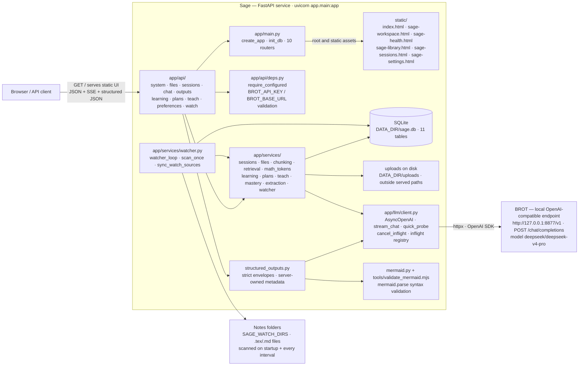
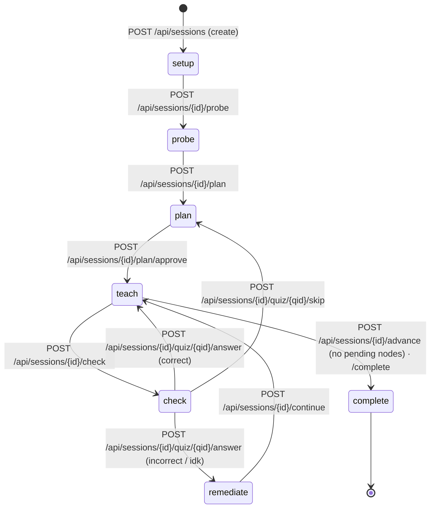
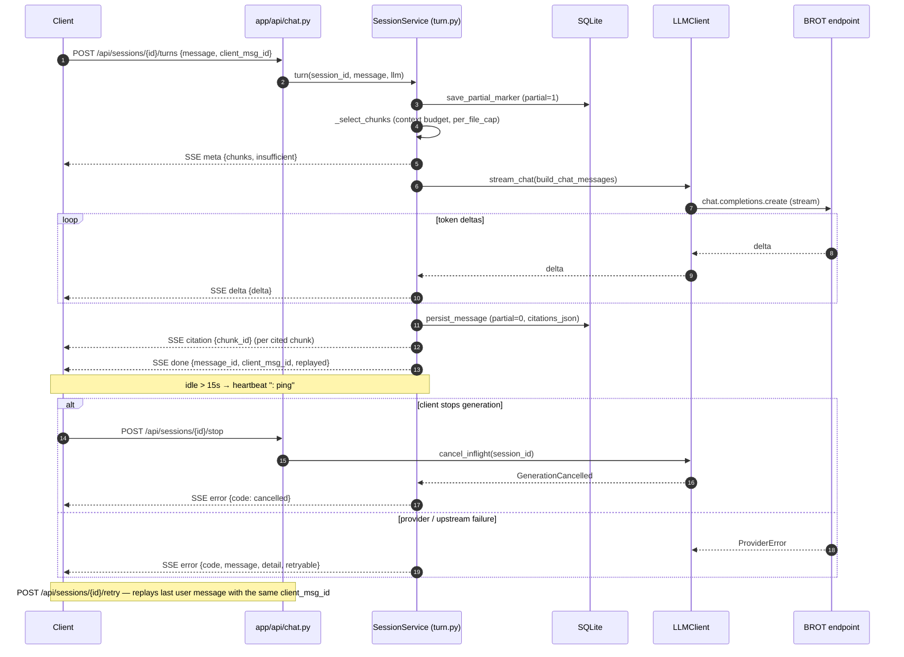

```
   _____         _____ ______ 
  / ____|  /\   / ____|  ____|
 | (___   /  \ | |  __| |__   
  \___ \ / /\ \| | |_ |  __|  
  ____) / ____ \ |__| | |____ 
 |_____/_/    \_\_____|______|
```

## Summary

Sage is a local-first web application that acts as a personalized AI tutor: attach study files (PDF, DOCX, PPTX, Markdown, LaTeX, text) or point it at a notes folder it watches automatically, and Sage chunks them, probes what you already know, builds a learning plan, teaches each node, checks understanding with quiz questions — including questions grounded in your LaTeX theorem/definition environments — and remediates weak spots, all through a grounded, streaming chat that cites the exact excerpts it used. The Python 3.11 FastAPI service serves the static web UI from `/` alongside JSON/SSE endpoints, talks to any OpenAI-compatible model endpoint (default: the local BROT server at `http://127.0.0.1:8877/v1`), and stores everything in SQLite plus files under `DATA_DIR` (default `~/.local/share/sage`), with uploads kept outside any served path.

## Project structure

```
sage/
├── app/
│   ├── main.py                      # FastAPI app factory · init_db · 10 routers
│   ├── config.py                    # Settings — BROT_* / SAGE_WATCH_* / HOST / PORT / limits, read from .env
│   ├── db.py                        # SQLite schema v2 · connection helpers
│   ├── models.py                    # Pydantic request/response models
│   ├── errors.py                    # error envelope + exception handlers
│   ├── sse.py                       # SSE helper — 15s heartbeat · sse_response
│   ├── logging_setup.py             # logging configuration
│   ├── util.py                      # id / utc_now helpers
│   ├── api/                         # HTTP routers
│   │   ├── deps.py                  #   require_configured · handle_value_error
│   │   ├── system.py                #   GET /api/health
│   │   ├── files.py                 #   /api/files upload · list · excerpts · retry · delete
│   │   ├── sessions.py              #   /api/sessions CRUD · select files · grounding
│   │   ├── chat.py                  #   /turns · /retry (SSE) · /stop
│   │   ├── outputs.py               #   /outputs structured chat · Mermaid · todo · quiz
│   │   ├── learning.py              #   /probe · /check · /notes-quiz · quiz answer
│   │   ├── plans.py                 #   /plan generate · approve · reorder · skip · expand · regenerate · select
│   │   ├── teach.py                 #   /advance · /continue · /complete · quiz hint/reveal/skip
│   │   ├── watch.py                 #   /api/watch list · add · scan · delete
│   │   └── preferences.py           #   /api/preferences · /api/mastery reset
│   ├── llm/
│   │   ├── client.py                # AsyncOpenAI client → BROT · stream_chat · cancel_inflight
│   │   ├── messages.py              # chat message builder · citation markers
│   │   ├── notes.py                 # notes-quiz generation · answerability check
│   │   ├── structured.py            # structured probe/plan question requests
│   │   └── structured_outputs.py     # exact JSON decoding · bounded repair · validation
│   └── services/
│       ├── sessions/                # session state machine package
│       │   ├── __init__.py          #   SessionService export
│       │   ├── session.py           #   PHASES · CRUD · select_files · grounding
│       │   ├── turn.py              #   SSE turn/retry stream generators
│       │   └── rows.py              #   plan node / quiz question row mappers
│       ├── files.py                 # upload · storage · chunk persistence · pairing
│       ├── chunking.py              # CHUNK_CHARS / CHUNK_OVERLAP splitter
│       ├── retrieval.py             # context-budget chunk selection
│       ├── math_tokens.py           # math-aware tokenizer (Greek · LaTeX · unicode)
│       ├── learning.py              # probe/check/notes generation · quiz grading
│       ├── plans.py                 # plan generate/approve/reorder/skip/expand
│       ├── teach.py                 # advance/continue/complete · hint/reveal
│       ├── mastery.py               # mastery_topics confidence tracking
│       ├── watcher.py               # notes folder watcher (scan loop · watch_sources)
│       ├── structured_outputs.py     # API-first structured artifact orchestration
│       ├── mermaid.py                # Node Mermaid syntax-validation adapter
│       └── extraction/              # base · pdf · docx · pptx · md · txt · tex → plain text
├── static/                           # browser UI served at `/` by app/main.py
│   ├── index.html                    # home chat and session creation
│   ├── sage-workspace.html            # persisted session workspace
│   ├── sage-health.html               # health dashboard
│   ├── sage-library.html              # file library
│   ├── sage-sessions.html             # session list
│   └── sage-settings.html             # preferences and settings
├── tools/
│   ├── check_wheels.py              # ARM64 wheel preflight check
│   ├── smoke_chat.py                # live endpoint smoke test
│   └── validate_mermaid.mjs         # Node Mermaid syntax validator (mermaid.parse)
├── tests/                           # offline pytest suite (faked LLM)
│   ├── conftest.py
│   ├── fakes/fake_llm.py
│   └── test_*.py                    # API, chunking, retrieval, plans, teach, mastery,
│                                    #   extraction_tex, math_tokens, watcher, notes_quiz…
├── docs/                            # operational docs + mermaid diagram sources
│   ├── README.md                    #   index
│   ├── setup.md                     #   install · run · LAN access · notes watch
│   ├── security.md                  #   trusted-network-only warning
│   ├── environment.md               #   env var reference
│   ├── testing.md                   #   tests · wheel preflight · smoke test
│   └── *.mmd                        #   UI notes diagrams (01-system-architecture … 08-latex-notes)
├── run.sh                           # one-command start (Linux/Pi)
├── run.bat                          # one-command start (Windows)
├── oc.bat                           # opencode web launcher (SMB-safe)
├── ui.txt                           # web UI notes
├── requirements.txt
├── package.json                     # Node deps for the Mermaid validator
├── package-lock.json                # pinned npm dependency tree
└── .env.example                     # copy to .env, fill in BROT_API_KEY
```

## Architecture

### System architecture



### Session state machine

Phases live in `app/services/sessions/session.py` (`PHASES = ("setup", "probe", "plan", "teach", "check", "remediate", "complete")`); the endpoints that drive each transition come from `app/api/`.



### SSE streaming chat

`POST /api/sessions/{id}/turns` streams `meta` → `delta`* → `citation`* → `done` over one SSE response; `POST /api/sessions/{id}/stop` cancels an inflight generation; `POST /api/sessions/{id}/retry` replays the last user message under the same `client_msg_id`. A `: ping` heartbeat fires whenever the stream is idle for 15s (`app/sse.py`).



### SQLite data model

Schema in `app/db.py` (SCHEMA_VERSION 2). Sessions reference files by JSON array in `file_ids_json` — there is no `session_files` join table. `mastery_topics` and `preferences` are global (not per-session). `watch_sources` records the notes folders the watcher scans.


