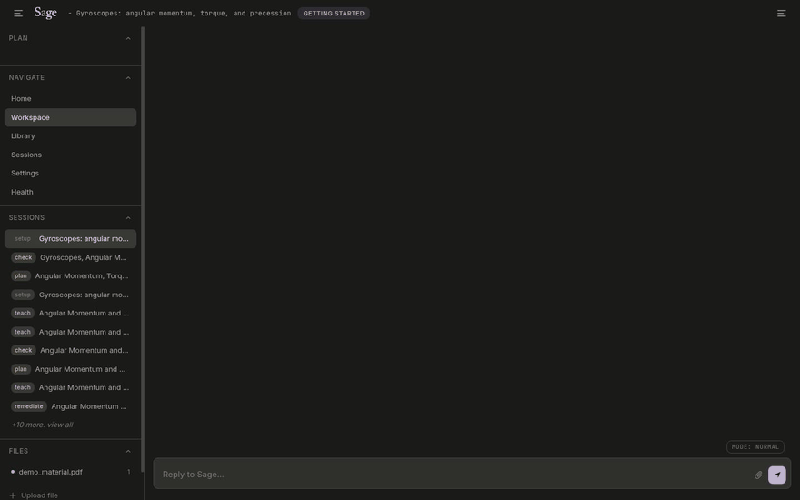
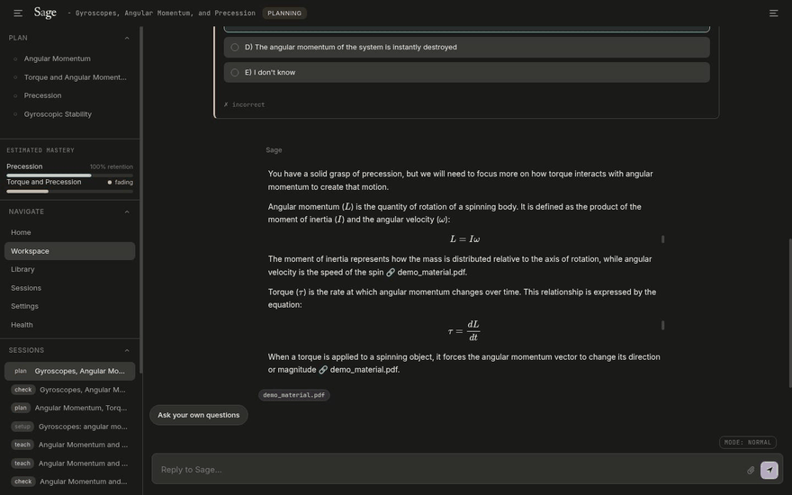
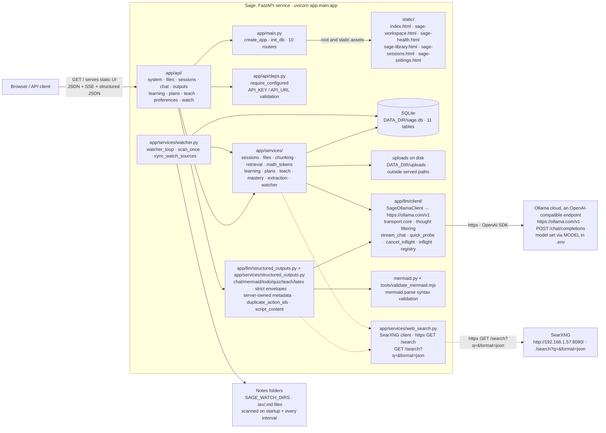
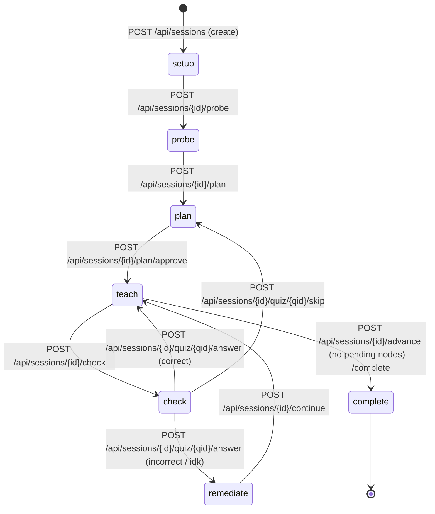
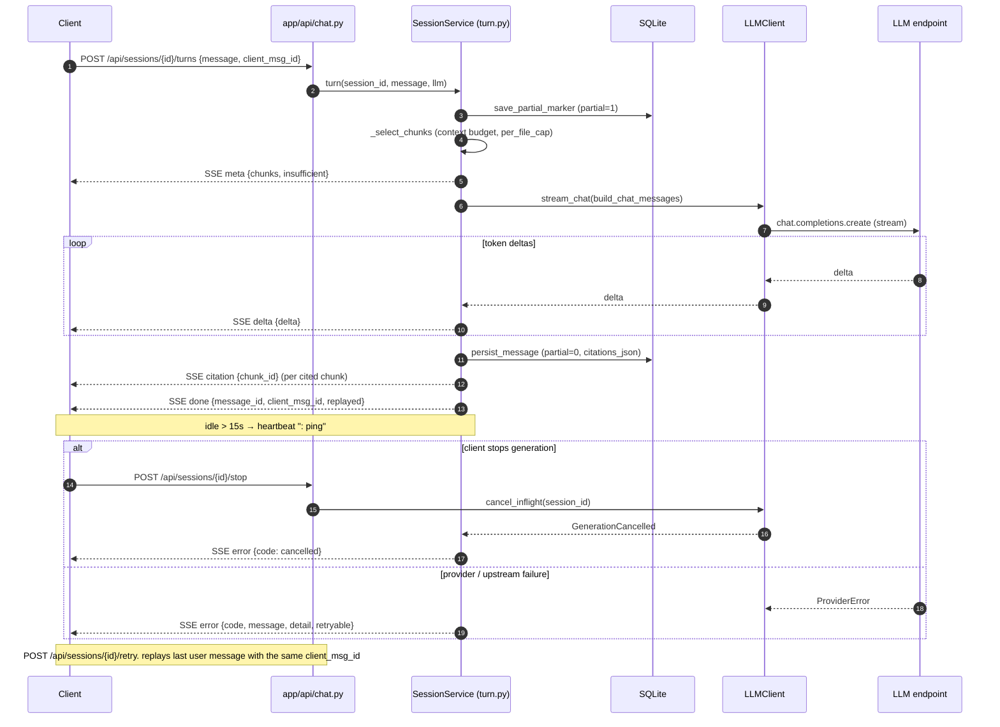
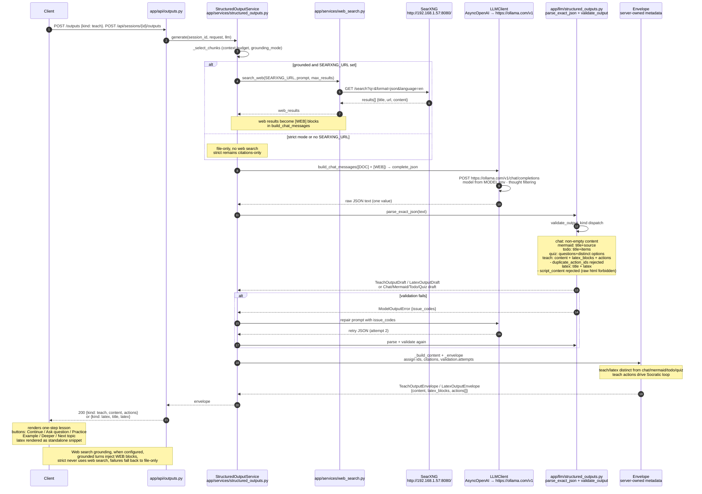
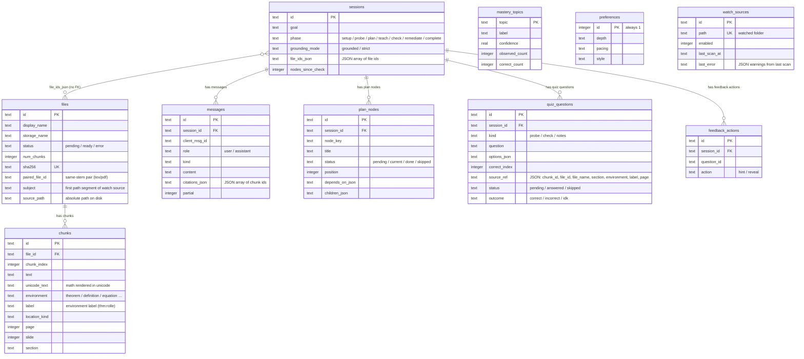

> **This project is not complete.** Sage is under active development and has rough
> edges. Things that are still being built or are known to be unfinished include:
> the PDF source viewer (currently a collapsible side rail, still being polished),
> in-text citation rendering, the automatic diagnostic probe that opens a session,
> the plan-building and re-teaching flow, LaTeX rendering in every card, and the
> final-quiz and grading loop. The UI changes often and the learning arc is still
> being tuned. Expect breaking changes.

## Summary

Sage is a local-first web app that works as a personal AI tutor. Attach study files (PDF, DOCX, PPTX, Markdown, LaTeX, text) or point it at a notes folder it watches on its own, and Sage chunks them, probes what you already know, builds a learning plan, teaches each topic, then runs a final quiz and re-teaches whatever did not stick. All of this happens through a grounded, streaming chat that cites the exact excerpts it used. The Python 3.11 FastAPI service serves the static UI from `/` alongside JSON and SSE endpoints, talks to an OpenAI-compatible endpoint (any Ollama model set via `MODEL`), can search the web via SearXNG when `SEARXNG_URL` is set, and keeps everything in SQLite plus files under `DATA_DIR` (default `~/.local/share/sage`), with uploads stored outside any served path.

Every session opens with a diagnostic probe: multiple-choice cards drawn from your own material, graded on the spot, with the right answer explained.

Teaching runs node by node off the plan rail, with rendered math, inline citations back to the source file, and a quick check after each step.

The API surface, configuration options, and deployment walkthroughs live in the [documentation](https://totallynotbrent.github.io/Sage/).

## Architecture

### System architecture

```mermaid
flowchart LR
    CLIENT["Browser / API client"] -->|"GET / serves static UI<br/>JSON + SSE + structured JSON"| API
    B["Ollama cloud, an OpenAI-compatible endpoint<br/>https://ollama.com/v1 · POST /chat/completions<br/>model set via MODEL in .env"]
    SEARXNG["SearXNG<br/>http://192.168.1.57:8080/ · /search?q=&format=json"]

    subgraph APP["Sage. FastAPI service · uvicorn app.main:app"]
        MAIN["app/main.py<br/>create_app · init_db · 10 routers"]
        UI["static/<br/>index.html · sage-workspace.html · sage-health.html<br/>sage-library.html · sage-sessions.html · sage-settings.html"]
        API["app/api/<br/>system · files · sessions · chat · outputs<br/>learning · plans · teach · preferences · watch"]
        DEPS["app/api/deps.py<br/>require_configured<br/>API_KEY / API_URL validation"]
        SVC["app/services/<br/>sessions · files · chunking · retrieval · math_tokens<br/>learning · plans · teach · mastery · extraction · watcher"]
        WATCH["app/services/watcher.py<br/>watcher_loop · scan_once · sync_watch_sources"]
        DB[("SQLite<br/>DATA_DIR/sage.db · 11 tables")]
        UP["uploads on disk<br/>DATA_DIR/uploads · outside served paths"]
        LLM["app/llm/client/<br/>SageOllamaClient → https://ollama.com/v1<br/>transport core · thought filtering<br/>stream_chat · quick_probe · cancel_inflight · inflight registry"]
        STRUCT["app/llm/structured_outputs.py + app/services/structured_outputs.py<br/>chat/mermaid/todo/quiz/teach/latex · strict envelopes<br/>server-owned metadata · duplicate_action_ids · script_content"]
        MERMAID["mermaid.py + tools/validate_mermaid.mjs<br/>mermaid.parse syntax validation"]
        WEBSEARCH["app/services/web_search.py<br/>SearXNG client · httpx GET /search<br/>GET /search?q=&format=json"]
    end
    NOTES["Notes folders<br/>SAGE_WATCH_DIRS · .tex/.md files<br/>scanned on startup + every interval"]

    API --> MAIN
    MAIN -->|"root and static assets"| UI
    API --> DEPS
    API --> SVC
    API --> STRUCT
    STRUCT --> MERMAID
    STRUCT --> LLM
    STRUCT -.-> WEBSEARCH
    SVC --> DB
    SVC --> UP
    SVC --> LLM
    SVC -.-> WEBSEARCH
    WEBSEARCH -.->|"httpx GET /search?q=&format=json"| SEARXNG
    WATCH --> NOTES
    WATCH --> DB
    WATCH --> SVC
    LLM -->|"httpx · OpenAI SDK"| B
```

### Session state machine

Phases live in `app/services/sessions/session.py` (`PHASES = ("setup", "probe", "plan", "teach", "check", "remediate", "complete")`); the endpoints that drive each transition come from `app/api/`.

```mermaid
stateDiagram-v2
    [*] --> setup: POST /api/sessions (create)
    setup --> probe: POST /api/sessions/{id}/probe
    probe --> plan: POST /api/sessions/{id}/plan
    plan --> teach: POST /api/sessions/{id}/plan/approve
    teach --> check: POST /api/sessions/{id}/check
    check --> remediate: POST /api/sessions/{id}/quiz/{qid}/answer (incorrect / idk)
    remediate --> teach: POST /api/sessions/{id}/continue
    check --> teach: POST /api/sessions/{id}/quiz/{qid}/answer (correct)
    check --> plan: POST /api/sessions/{id}/quiz/{qid}/skip
    teach --> complete: POST /api/sessions/{id}/advance (no pending nodes) · /complete
    complete --> [*]
```

### SSE streaming chat

`POST /api/sessions/{id}/turns` streams `meta` → `delta`* → `citation`* → `done` over one SSE response; `POST /api/sessions/{id}/stop` cancels an inflight generation; `POST /api/sessions/{id}/retry` replays the last user message under the same `client_msg_id`. A `: ping` heartbeat fires whenever the stream is idle for 15s (`app/sse.py`).

```mermaid
sequenceDiagram
    autonumber
    participant C as Client
    participant CH as app/api/chat.py
    participant T as SessionService (turn.py)
    participant DB as SQLite
    participant LLM as LLMClient
    participant B as LLM endpoint

    C->>CH: POST /api/sessions/{id}/turns {message, client_msg_id}
    CH->>T: turn(session_id, message, llm)
    T->>DB: save_partial_marker (partial=1)
    T->>T: _select_chunks (context budget, per_file_cap)
    T-->>C: SSE meta {chunks, insufficient}
    T->>LLM: stream_chat(build_chat_messages)
    LLM->>B: chat.completions.create (stream)
    loop token deltas
        B-->>LLM: delta
        LLM-->>T: delta
        T-->>C: SSE delta {delta}
    end
    T->>DB: persist_message (partial=0, citations_json)
    T-->>C: SSE citation {chunk_id} (per cited chunk)
    T-->>C: SSE done {message_id, client_msg_id, replayed}
    Note over C,T: idle > 15s → heartbeat ": ping"

    alt client stops generation
        C->>CH: POST /api/sessions/{id}/stop
        CH->>LLM: cancel_inflight(session_id)
        LLM-->>T: GenerationCancelled
        T-->>C: SSE error {code: cancelled}
    else provider / upstream failure
        B-->>LLM: ProviderError
        T-->>C: SSE error {code, message, detail, retryable}
    end

    Note over C,CH: POST /api/sessions/{id}/retry. replays last user message with the same client_msg_id
```

### Structured outputs and Socratic teaching (teach/latex + actions)

`POST /api/sessions/{id}/outputs` validates `chat` / `mermaid` / `todo` / `quiz` plus new `teach` (Socratic one-step lesson + follow-up actions: continue/ask_question/practice/example/deeper/next_topic) and `latex` (standalone LaTeX snippet) through `app/llm/structured_outputs.py` + `app/services/structured_outputs.py`. When `SEARXNG_URL` is set, grounded teach/latex turns include web results as `[WEB]` blocks alongside `[DOC]` excerpts; strict mode stays file-only and search failures fall back to file-only.

```mermaid
sequenceDiagram
    autonumber
    participant C as Client
    participant API as app/api/outputs.py
    participant SVC as StructuredOutputService<br/>app/services/structured_outputs.py
    participant WS as app/services/web_search.py
    participant SX as SearXNG<br/>http://192.168.1.57:8080/
    participant LLM as LLMClient<br/>AsyncOpenAI → https://ollama.com/v1
    participant VAL as app/llm/structured_outputs.py<br/>parse_exact_json + validate_output
    participant ENV as Envelope<br/>server-owned metadata

    C->>API: POST /outputs {kind: teach}. POST /api/sessions/{id}/outputs
    API->>SVC: generate(session_id, request, llm)
    SVC->>SVC: _select_chunks (context budget, grounding_mode)
    alt grounded and SEARXNG_URL set
        SVC->>WS: search_web(SEARXNG_URL, prompt, max_results)
        WS->>SX: GET /search?q=&format=json&language=en
        SX-->>WS: results[] {title, url, content}
        WS-->>SVC: web_results
        Note over SVC,WS: web results become [WEB] blocks<br/>in build_chat_messages
    else strict mode or no SEARXNG_URL
        Note over SVC: file-only, no web search<br/>strict remains citations-only
    end
    SVC->>LLM: build_chat_messages([DOC] + [WEB]) → complete_json
    LLM->>LLM: POST https://ollama.com/v1/chat/completions<br/>model from MODEL env · thought filtering
    LLM-->>SVC: raw JSON text (one value)
    SVC->>VAL: parse_exact_json(text)
    VAL->>VAL: validate_output. kind dispatch
    Note over VAL: chat: non-empty content<br/>mermaid: title+source<br/>todo: title+items<br/>quiz: questions+distinct options<br/>teach: content + latex_blocks + actions<br/>  - duplicate_action_ids rejected<br/>latex: title + latex<br/>  - script_content rejected (raw html forbidden)
    VAL-->>SVC: TeachOutputDraft / LatexOutputDraft<br/>or Chat/Mermaid/Todo/Quiz draft
    alt validation fails
        VAL-->>SVC: ModelOutputError {issue_codes}
        SVC->>LLM: repair prompt with issue_codes
        LLM-->>SVC: retry JSON (attempt 2)
        SVC->>VAL: parse + validate again
    end
    SVC->>ENV: _build_content + _envelope<br/>assign ids, citations, validation.attempts
    Note over ENV: teach/latex distinct from chat/mermaid/todo/quiz<br/>teach actions drive Socratic loop
    ENV-->>SVC: TeachOutputEnvelope / LatexOutputEnvelope<br/>{content, latex_blocks, actions[]}
    SVC-->>API: envelope
    API-->>C: 200 {kind: teach, content, actions}<br/>or {kind: latex, title, latex}
    Note over C: renders one-step lesson<br/>buttons: Continue / Ask question / Practice<br/>Example / Deeper / Next topic<br/>latex rendered as standalone snippet
    Note over C,API: Web search grounding, when configured,<br/>grounded turns inject WEB blocks,<br/>strict never uses web search, failures fall back to file-only
```

### SQLite data model

Schema in `app/db.py` (SCHEMA_VERSION 2). Sessions reference files by JSON array in `file_ids_json`; there is no `session_files` join table. `mastery_topics` and `preferences` are global (not per-session). `watch_sources` records the notes folders the watcher scans.

```mermaid
erDiagram
    sessions }o--o{ files : "file_ids_json (no FK)"
    files ||--o{ chunks : "has chunks"
    sessions ||--o{ messages : "has messages"
    sessions ||--o{ plan_nodes : "has plan nodes"
    sessions ||--o{ quiz_questions : "has quiz questions"
    sessions ||--o{ feedback_actions : "has feedback actions"

    files {
        text id PK
        text display_name
        text storage_name
        text status "pending / ready / error"
        integer num_chunks
        text sha256 UK
        text paired_file_id "same-stem pair (tex/pdf)"
        text subject "first path segment of watch source"
        text source_path "absolute path on disk"
    }
    chunks {
        text id PK
        text file_id FK
        integer chunk_index
        text text
        text unicode_text "math rendered in unicode"
        text environment "theorem / definition / equation …"
        text label "environment label (thm:rolle)"
        text location_kind
        integer page
        integer slide
        text section
    }
    sessions {
        text id PK
        text goal
        text phase "setup / probe / plan / teach / check / remediate / complete"
        text grounding_mode "grounded / strict"
        text file_ids_json "JSON array of file ids"
        integer nodes_since_check
    }
    messages {
        text id PK
        text session_id FK
        text client_msg_id
        text role "user / assistant"
        text kind
        text content
        text citations_json "JSON array of chunk ids"
        integer partial
    }
    plan_nodes {
        text id PK
        text session_id FK
        text node_key
        text title
        text status "pending / current / done / skipped"
        integer position
        text depends_on_json
        text children_json
    }
    quiz_questions {
        text id PK
        text session_id FK
        text kind "probe / check / notes"
        text question
        text options_json
        integer correct_index
        text source_ref "JSON: chunk_id, file_id, file_name, section, environment, label, page"
        text status "pending / answered / skipped"
        text outcome "correct / incorrect / idk"
    }
    feedback_actions {
        text id PK
        text session_id FK
        text question_id
        text action "hint / reveal"
    }
    mastery_topics {
        text topic PK
        text label
        real confidence
        integer observed_count
        integer correct_count
    }
    preferences {
        integer id PK "always 1"
        text depth
        text pacing
        text style
    }
    watch_sources {
        text id PK
        text path UK "watched folder"
        integer enabled
        text last_scan_at
        text last_error "JSON warnings from last scan"
    }
```

## License

Sage is licensed under the GNU Affero General Public License v3.0. See the LICENSE file in the repository root.
