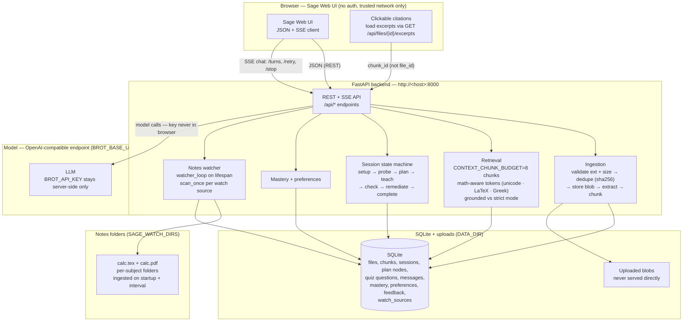

# System Architecture

High-level Sage architecture: study files, chunking, retrieval, session loop, streaming chat, and the data model.

```mermaid
flowchart TB
    subgraph Browser["Browser — Sage Web UI (no auth, trusted network only)"]
        UI["Sage Web UI<br/>JSON + SSE client"]
        CITATIONS["Clickable citations<br/>load excerpts via GET /api/files/{id}/excerpts"]
    end

    subgraph Server["FastAPI backend — http://&lt;host&gt;:8000"]
        API["REST + SSE API<br/>/api/* endpoints"]
        INGEST["Ingestion<br/>validate ext + size → dedupe (sha256)<br/>→ store blob → extract → chunk"]
        RETRIEVAL["Retrieval<br/>CONTEXT_CHUNK_BUDGET=8 chunks<br/>math-aware tokens (unicode · LaTeX · Greek)<br/>grounded vs strict mode"]
        SM["Session state machine<br/>setup → probe → plan → teach<br/>→ check → remediate → complete"]
        MASTERY["Mastery + preferences"]
        WATCH["Notes watcher<br/>watcher_loop on lifespan<br/>scan_once per watch source"]
    end

    subgraph Watch["Notes folders (SAGE_WATCH_DIRS)"]
        NOTES["calc.tex + calc.pdf<br/>per-subject folders<br/>ingested on startup + interval"]
    end

    subgraph Storage["SQLite + uploads (DATA_DIR)"]
        DB[("SQLite<br/>files, chunks, sessions, plan nodes,<br/>quiz questions, messages,<br/>mastery, preferences, feedback,<br/>watch_sources")]
        BLOBS["Uploaded blobs<br/>never served directly"]
    end

    subgraph Model["Model — OpenAI-compatible endpoint (BROT_BASE_URL)"]
        LLM["LLM<br/>BROT_API_KEY stays server-side only"]
    end

    UI -->|"JSON (REST)"| API
    UI -->|"SSE chat: /turns, /retry, /stop"| API
    CITATIONS -->|"chunk_id (not file_id)"| API
    API --> INGEST
    API --> RETRIEVAL
    API --> SM
    API --> MASTERY
    API --> WATCH
    INGEST --> DB
    INGEST --> BLOBS
    RETRIEVAL --> DB
    SM --> DB
    MASTERY --> DB
    WATCH --> NOTES
    WATCH --> DB
    API -->|"model calls — key never in browser"| LLM
```

## See also
- [[02-learning-loop]]
- [[06-data-model-er]]
