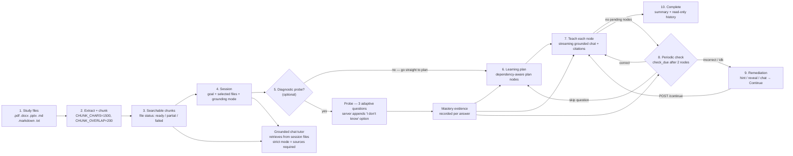

# Learning Loop

The end-to-end tutoring loop: files to chunks to session to probe, plan, teach, check, remediate, complete.

## Latency-weighted mastery signal

Every quiz answer carries a `latency_ms` stamp: the UI records `performance.now()`
when the answer card renders and sends the retrieval time with the answer (as a
`[<n>ms]` badge in the graded chat reply, or as `latency_ms` in the review-grade
JSON). When absent, the server falls back to the `created_at → answered_at` gap,
and pre-existing rows are backfilled from those timestamps on migration to schema
version 4.

The stamp feeds three scheduling layers, so retrieval effort counts alongside
accuracy:

- **Mastery (Laplace confidence):** answers bucket into
  `fast-correct / slow-correct / fast-wrong / slow-wrong` (8s fast/slow cutoff).
  A slow-correct or slow-wrong adds an implicit observed event, so an effortful
  recall is weaker than it looks and an effortful miss schedules hardest —
  producing the monotonic ladder fast-correct > slow-correct > fast-wrong >
  slow-wrong.
- **Adaptive question count:** the acing branch (recent corrects + confidence
  ≥ 0.6 → one light check) now also requires fast corrects; slow recent corrects
  keep the standard two-question check.
- **FSRS review cards:** a slow-but-correct first recall seeds a lower initial
  stability (×0.6, floored at 1 day), so the card's stability-derived intervals
  shrink and it returns sooner.

## See also
- [[01-system-architecture|System Architecture]]
- [[03-session-state-machine|Session State Machine]]
- [[08-latex-notes|LaTeX Notes]]
