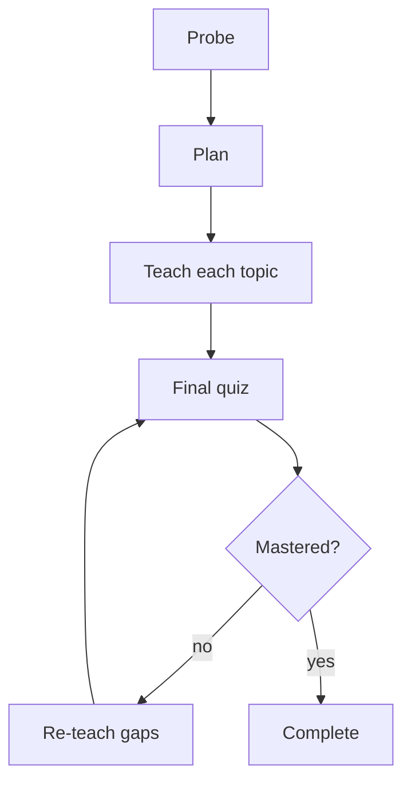

# How Sage teaches

One clean arc: probe what you know, teach it, check what stuck, re-teach the gaps.

- **Probe** — a few questions to gauge what you already know.
- **Plan** — the topics to cover, in the order they build on each other.
- **Teach** — clear streaming prose grounded in your study files; you can ask questions anytime.
- **Final quiz** — re-asks the probe and adds fresh questions spanning every topic. It never repeats wording.
- **Complete** — on a pass it summarizes; on a miss it re-teaches just those points and re-quizzes.

## See also
- [[index|Sage]]
- [[ui|Using the web UI]]
- [[08-latex-notes|LaTeX notes]]