# How Sage teaches

One arc: probe what you know, teach it, check what stuck, re-teach the gaps.

```mermaid
flowchart TB
    subgraph S0["Session start"]
        A["Welcome · 'teach me X'"] --> B["Diagnostic probe — adaptive questions + 'I don't know' option"]
        B --> C{"Graded on answer + confidence + latency"}
        C -->|"strong recall"| D["Strength profile: high"]
        C -->|"weak / unsure"| D["Strength profile: low"]
    end
    subgraph S1["Planning"]
        D --> E["Build dependency-ordered plan of topics"]
        E --> F["Plan shown for approval"]
    end
    subgraph S2["Teaching loop"]
        F --> G["Teach topic — streaming prose, grounded in your files, sources cited"]
        G --> H{"You ask a question?"}
        H -->|"yes"| I["Answer in context, re-anchor the point"] --> G
        H -->|"no"| J["Next topic in plan"]
        J -->|"topics remain"| G
        J -->|"no topics left"| K["Comprehensive final quiz"]
    end
    subgraph S3["Final quiz & resolve"]
        K --> L["Re-asks the probe questions + fresh questions spanning every node · deduplicated so nothing repeats"]
        L --> M{"Quiz graded"}
        M -->|"mastered"| N["Session complete · summary + history"]
        M -->|"gaps remain"| O["Re-teach just the missed points"] --> L
    end
    style S0 fill:#191724,stroke:#9ccfd8
    style S1 fill:#191724,stroke:#9ccfd8
    style S2 fill:#191724,stroke:#9ccfd8
    style S3 fill:#191724,stroke:#9ccfd8
```

- **Probe** — a few questions to gauge what you already know.
- **Teach** — clear streaming prose grounded in your files; ask questions anytime.
- **Final quiz** — the probe questions plus fresh ones spanning every topic, never repeated.
- **Complete** — on a pass it summarizes; on a miss it re-teaches just those points and re-quizzes.

## Modes

- **Normal** (default) — your files as primary context, plus general knowledge and the web-search tool.
- **Strict** — teaches from your uploaded PDF: the plan mirrors the document's own sections, content and quiz stay in it, web search is off.

Toggle the mode with the button above the reply box (see [[ui|Using the web UI]]).

## See also
- [[index|Sage]]
- [[ui|Using the web UI]]
- [[08-latex-notes|LaTeX notes]]