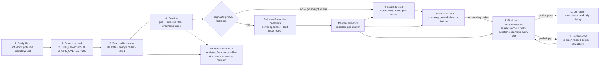

# Learning Loop

The end-to-end tutoring loop: files to chunks to session to probe, plan, teach, final quiz, remediate, complete.

## Latency-weighted mastery signal

Every quiz answer carries a `latency_ms` stamp. In the question flow the UI shows
a **Continue** gate after the narration: the reading appears first, the questions
are revealed only when the learner presses **Continue**, and each card stamps its
own `performance.now()` render time and answer time, so every question reports
its **own** retrieval time (as a `[<n>ms]` badge in the graded chat reply, or as
`latency_ms` in the review-grade JSON) rather than one shared whole-batch figure.
When absent, the server falls back to the `created_at → answered_at` gap, and
pre-existing rows are backfilled from those timestamps on migration to schema
version 4.

The stamp feeds three scheduling layers, so retrieval effort counts alongside
accuracy:

- **Mastery (Laplace confidence):** answers bucket into
  `fast-correct / slow-correct / fast-wrong / slow-wrong` (8s fast/slow cutoff).
  A slow-correct or slow-wrong adds an implicit observed event, so an effortful
  recall is weaker than it looks and an effortful miss schedules hardest —
  producing the monotonic ladder fast-correct > slow-correct > fast-wrong >
  slow-wrong.
- **Adaptive question count:** the acing branch (recent corrects + confidence
  ≥ 0.6 → one light check) now also requires fast corrects; slow recent corrects
  keep the standard two-question check.
- **FSRS review cards:** a slow-but-correct first recall seeds a lower initial
  stability (×0.6, floored at 1 day), so the card's stability-derived intervals
  shrink and it returns sooner.

## Per-node pretest

`LearningService.generate_pretest(session_id, llm)` fires **one** diagnostic
question (`kind='pretest'`, `count=1`) on the **current plan node's title**
(falling back to the session goal when no node is current). It mirrors
`generate_check`: idempotent (re-returns any pending pretest), topic forced to
the node title, options get the server-appended "I don't know" row, and the
session phase is left untouched so teaching can proceed with the pending card
rendered through the probe-card path. Return shape is the same
`{"session", "questions"}` dict as `generate_check`.

## See also
- [[01-system-architecture|System Architecture]]
- [[03-session-state-machine|Session State Machine]]
- [[08-latex-notes|LaTeX Notes]]

## Per-session mastery & grounded checks

- **Mastery is per-session** (schema v4 → v5): the `mastery_topics` table is keyed
  `(session_id, topic)`, and every read/write — `record_evidence`,
  `apply_statement`, `summarize_mastery` (the prompt summary), `topic_confidence`,
  `lowest_confidence_topics`, and the UI `mastery_panel` — filters by the current
  `session_id`. One session's mastery never bleeds into another's panel or into
  the adaptive-count / interleave sampling for another session. Pre-v5 rows fold
  under `session_id=''` on migration.
- **Check questions are grounded in the current node's topic.** The former
  every-3rd-check "interleaved weak-topic" sampling was removed, so `generate_check`
  always targets `_current_node_title` (or the session goal) and never asks an
  unrelated prior topic mid-lesson.
- **No intermediate check rounds.** The periodic mid-lesson check cards were
  removed (2026-09-05, user direction); teaching is now dense prose that invites
  the learner's own questions, so `check_due` is always `false` and the only
  formal question rounds are the opening probe and the closing **comprehensive
  final quiz** (`run_final_quiz` → `generate_final_quiz`).
- **Comprehensive final quiz, deduplicated.** `generate_final_quiz` re-asks this
  session's probe questions, then adds fresh questions spanning every plan node.
  Questions whose normalized stem already exists among the session's finals are
  skipped (`_norm_stem` + `_final_stems`), so re-quiz rounds stop re-adding the
  same wording; a graded gap sends the learner back through remediation to a
  fresh quiz round.
- **No repeated stems.** `request_questions` accepts an `avoid` list — the session's
  recent question stems are passed in for probe/quiz so the model writes fresh
  stems and distractors instead of recycling near-identical questions.
- **Pending questions persist across a reload** (issue: refresh regeneration): the
  server keeps unanswered questions in `quiz_questions` (`status='pending'`), and
  `loadSession` re-renders them on load instead of regenerating.
