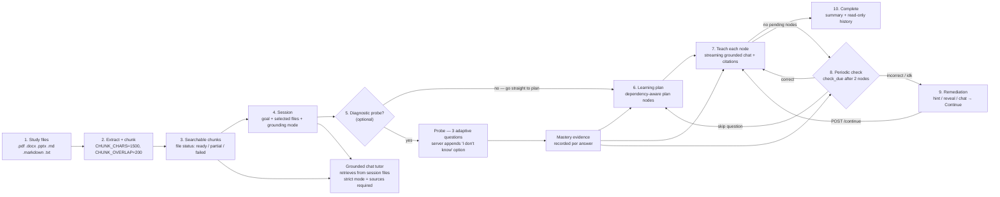

# Learning Loop

The end-to-end tutoring loop: files to chunks to session to probe, plan, teach, check, remediate, complete.

## See also
- [[01-system-architecture]]
- [[03-session-state-machine]]
- [[08-latex-notes]]
