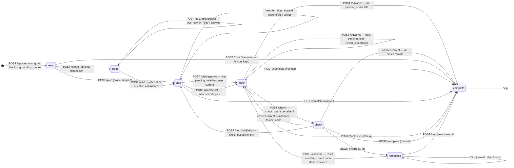

# Session State Machine

Session phases and the transitions between them.

```mermaid
stateDiagram-v2
    direction LR

    [*] --> setup: POST /api/sessions {goal, file_ids, grounding_mode}

    setup --> probe: POST /probe (optional diagnostic)
    setup --> plan: POST /plan (probe skipped)

    probe --> probe: POST /quiz/{qid}/answer — incorrect/idk, retry if allowed
    probe --> plan: POST /plan — after all 3 questions answered

    plan --> plan: "reorder | skip | expand | regenerate | select"
    plan --> teach: POST /plan/approve — first pending node becomes current
    plan --> teach: POST /plan/select — manual node pick

    teach --> teach: POST /advance — next pending node (check_due=false)
    teach --> check: POST /check — check_due=true (after 2 nodes)
    teach --> complete: POST /advance — no pending nodes left

    check --> teach: answer correct — advance to next node
    check --> complete: answer correct — no nodes remain
    check --> remediate: answer incorrect / idk
    check --> plan: POST /quiz/{qid}/skip — check questions only

    remediate --> remediate: "hint | reveal | chat /turns"
    remediate --> teach: POST /continue — reset counter, current node done, advance

    setup --> complete: POST /complete (manual, history kept)
    probe --> complete: POST /complete (manual)
    plan --> complete: POST /complete (manual)
    teach --> complete: POST /complete (manual)
    check --> complete: POST /complete (manual)
    remediate --> complete: POST /complete (manual)

    complete --> [*]
```

## See also
- [[02-learning-loop|Learning Loop]]
- [[07-ui-screens|UI Screens]]
