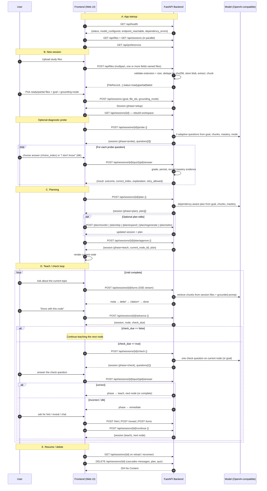

# Complete UI Flow (sequence)

Sequence diagram of the recommended complete web UI flow.

```mermaid
sequenceDiagram
    autonumber
    participant U as User
    participant F as Frontend (Web UI)
    participant A as FastAPI Backend
    participant M as Model (OpenAI-compatible)

    Note over F,A: A. App startup
    F->>A: GET /api/health
    A-->>F: {status, model_configured, endpoint_reachable, dependency_errors}
    F->>A: GET /api/files + GET /api/sessions (in parallel)
    F->>A: GET /api/preferences

    Note over U,F: B. New session
    U->>F: Upload study files
    F->>A: POST /api/files (multipart, one or more fields named files)
    A->>A: validate extension + size, dedupe by sha256, store blob, extract, chunk
    A-->>F: [FileRecord...] status=ready|partial|failed
    U->>F: Pick ready/partial files + goal + grounding mode
    F->>A: POST /api/sessions {goal, file_ids, grounding_mode}
    A-->>F: Session (phase=setup)
    F->>A: GET /api/sessions/{id} — rebuild workspace

    Note over U,F: Optional diagnostic probe
    F->>A: POST /api/sessions/{id}/probe {}
    A->>M: 3 adaptive questions from goal, chunks, mastery, mode
    A-->>F: {session (phase=probe), questions[3]}
    loop For each probe question
        U->>F: choose answer (choice_index) or "I don't know" (idk)
        F->>A: POST /api/sessions/{id}/quiz/{qid}/answer
        A->>A: grade, persist, record mastery evidence
        A-->>F: {result: outcome, correct_index, explanation, retry_allowed}
    end

    Note over U,F: C. Planning
    F->>A: POST /api/sessions/{id}/plan {}
    A->>M: dependency-aware plan from goal, chunks, mastery
    A-->>F: {session (phase=plan), plan[]}
    opt Optional plan edits
        F->>A: POST /plan/reorder | /plan/skip | /plan/expand | /plan/regenerate | /plan/select
        A-->>F: updated session + plan
    end
    F->>A: POST /api/sessions/{id}/plan/approve {}
    A-->>F: {session (phase=teach, current_node_id), plan}
    F->>F: render current node

    Note over U,F: D. Teach / check loop
    loop Until complete
        U->>F: Ask about the current topic
        F->>A: POST /api/sessions/{id}/turns (SSE stream)
        A->>M: retrieve chunks from session files + grounded prompt
        A-->>F: meta → delta* → citation* → done
        U->>F: "Done with this node"
        F->>A: POST /api/sessions/{id}/advance {}
        A-->>F: {session, node, check_due}
        alt check_due == false
            Note over F: Continue teaching the next node
        else check_due == true
            F->>A: POST /api/sessions/{id}/check {}
            A->>M: one check question on current node (or goal)
            A-->>F: {session (phase=check), questions[1]}
            U->>F: answer the check question
            F->>A: POST /api/sessions/{id}/quiz/{qid}/answer
            alt correct
                A-->>F: phase → teach, next node (or complete)
            else incorrect / idk
                A-->>F: phase → remediate
                U->>F: ask for hint / reveal / chat
                F->>A: POST /hint | POST /reveal | POST /turns
                F->>A: POST /api/sessions/{id}/continue {}
                A-->>F: {session (teach), next node}
            end
        end
    end

    Note over U,F: E. Resume / delete
    F->>A: GET /api/sessions/{id} on reload / reconnect
    F->>A: DELETE /api/sessions/{id} (cascades messages, plan, quiz)
    A-->>F: 204 No Content
```

## See also
- [[07-ui-screens]]
- [[05-streaming-chat-sse]]
