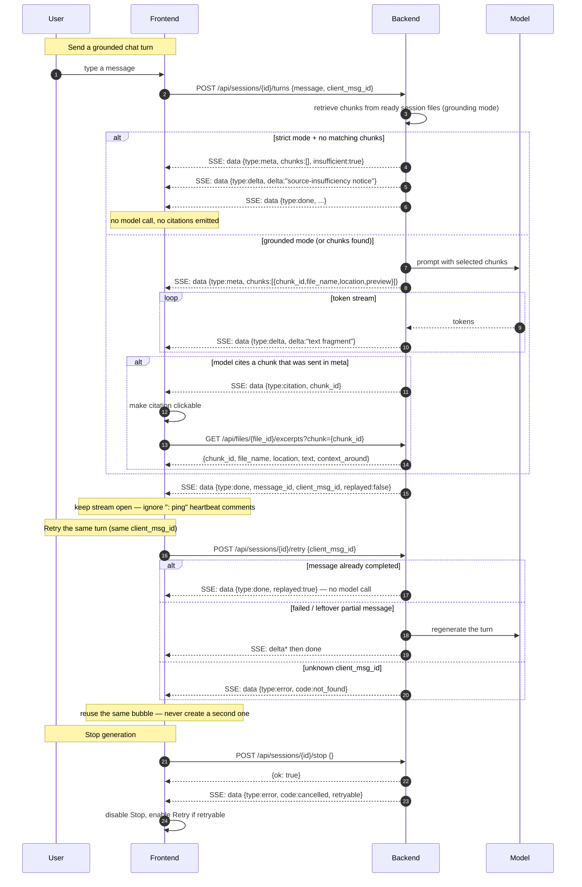

# Streaming Chat & SSE

SSE event flows for streaming chat: /turns, /retry, /stop, citations, heartbeats.

## See also
- [[01-system-architecture]]
- [[04-complete-ui-flow-sequence]]
- [[03-session-state-machine]]
