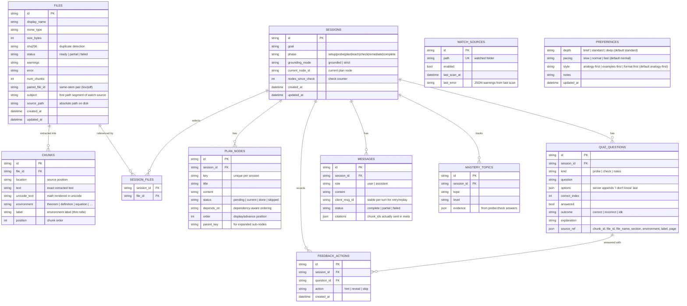

# Data Model (ER)

SQLite data model: files, chunks, sessions, plan nodes, quiz, messages, mastery, feedback.

```mermaid
erDiagram
    FILES ||--o{ CHUNKS : "extracted into"
    FILES ||--o{ SESSION_FILES : "referenced by"
    SESSIONS ||--o{ SESSION_FILES : "selects"
    SESSIONS ||--o{ PLAN_NODES : "has"
    SESSIONS ||--o{ QUIZ_QUESTIONS : "has"
    SESSIONS ||--o{ MESSAGES : "has"
    SESSIONS ||--o{ MASTERY_TOPICS : "tracks"
    SESSIONS ||--o{ FEEDBACK_ACTIONS : "records"
    QUIZ_QUESTIONS ||--o{ FEEDBACK_ACTIONS : "answered with"

    FILES {
        string id PK
        string display_name
        string mime_type
        int size_bytes
        string sha256 "duplicate detection"
        string status "ready | partial | failed"
        string warnings
        string error
        int num_chunks
        string paired_file_id "same-stem pair (tex/pdf)"
        string subject "first path segment of watch source"
        string source_path "absolute path on disk"
        datetime created_at
        datetime updated_at
    }

    CHUNKS {
        string id PK
        string file_id FK
        string location "source position"
        string text "exact extracted text"
        string unicode_text "math rendered in unicode"
        string environment "theorem | definition | equation | …"
        string label "environment label (thm:rolle)"
        int position "chunk order"
    }

    SESSIONS {
        string id PK
        string goal
        string phase "setup|probe|plan|teach|check|remediate|complete"
        string grounding_mode "grounded | strict"
        string current_node_id "current plan node"
        int nodes_since_check "check counter"
        datetime created_at
        datetime updated_at
    }

    SESSION_FILES {
        string session_id FK
        string file_id FK
    }

    PLAN_NODES {
        string id PK
        string session_id FK
        string key "unique per session"
        string title
        string content
        string status "pending | current | done | skipped"
        string depends_on "dependency-aware ordering"
        int order "display/advance position"
        string parent_key "for expanded sub-nodes"
    }

    QUIZ_QUESTIONS {
        string id PK
        string session_id FK
        string kind "probe | check | notes"
        string question
        json options "server appends 'I don't know' last"
        int correct_index
        bool answered
        string outcome "correct | incorrect | idk"
        string explanation
        json source_ref "chunk_id, file_id, file_name, section, environment, label, page"
    }

    WATCH_SOURCES {
        string id PK
        string path UK "watched folder"
        bool enabled
        datetime last_scan_at
        string last_error "JSON warnings from last scan"
    }

    FEEDBACK_ACTIONS {
        string id PK
        string session_id FK
        string question_id FK
        string action "hint | reveal | skip"
        datetime created_at
    }

    MESSAGES {
        string id PK
        string session_id FK
        string role "user | assistant"
        string content
        string client_msg_id "stable per turn for retry/replay"
        string status "complete | partial | failed"
        json citations "chunk_ids actually sent in meta"
    }

    MASTERY_TOPICS {
        string id PK
        string session_id FK
        string topic
        string level
        json evidence "from probe/check answers"
    }

    PREFERENCES {
        string depth "brief | standard | deep (default standard)"
        string pacing "slow | normal | fast (default normal)"
        string style "analogy-first | examples-first | formal-first (default analogy-first)"
        string notes
        datetime updated_at
    }
```

## See also
- [[01-system-architecture]]
- [[02-learning-loop]]
