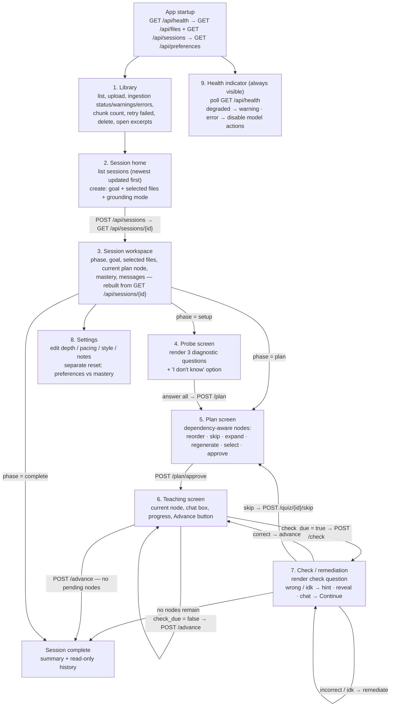

# UI Screens

Suggested web UI screens and navigation between them.

```mermaid
flowchart TB
    START["App startup<br/>GET /api/health → GET /api/files + GET /api/sessions → GET /api/preferences"] --> LIB["1. Library<br/>list, upload, ingestion status/warnings/errors,<br/>chunk count, retry failed, delete, open excerpts"]
    LIB --> HOME["2. Session home<br/>list sessions (newest updated first)<br/>create: goal + selected files + grounding mode"]

    HOME -->|"POST /api/sessions → GET /api/sessions/{id}"| WS["3. Session workspace<br/>phase, goal, selected files, current plan node,<br/>mastery, messages — rebuilt from GET /api/sessions/{id}"]

    WS -->|"phase = setup"| PROBE["4. Probe screen<br/>render 3 diagnostic questions<br/>+ 'I don't know' option"]
    WS -->|"phase = plan"| PLAN["5. Plan screen<br/>dependency-aware nodes:<br/>reorder · skip · expand · regenerate · select · approve"]
    PROBE -->|"answer all → POST /plan"| PLAN

    PLAN -->|"POST /plan/approve"| TEACH["6. Teaching screen<br/>current node, chat box, progress, Advance button"]
    TEACH -->|"check_due = false → POST /advance"| TEACH
    TEACH -->|"check_due = true → POST /check"| CHECK["7. Check / remediation<br/>render check question<br/>wrong / idk → hint · reveal · chat → Continue"]
    CHECK -->|"correct → advance"| TEACH
    CHECK -->|"incorrect / idk → remediate"| CHECK
    CHECK -->|"skip → POST /quiz/{id}/skip"| PLAN
    CHECK -->|"no nodes remain"| COMPLETE["Session complete<br/>summary + read-only history"]
    TEACH -->|"POST /advance — no pending nodes"| COMPLETE
    WS -->|"phase = complete"| COMPLETE

    WS --> SET["8. Settings<br/>edit depth / pacing / style / notes<br/>separate reset: preferences vs mastery"]

    START --> HEALTH["9. Health indicator (always visible)<br/>poll GET /api/health<br/>degraded → warning · error → disable model actions"]
```

## See also
- [[04-complete-ui-flow-sequence]]
- [[03-session-state-machine]]
