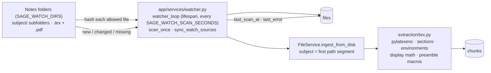
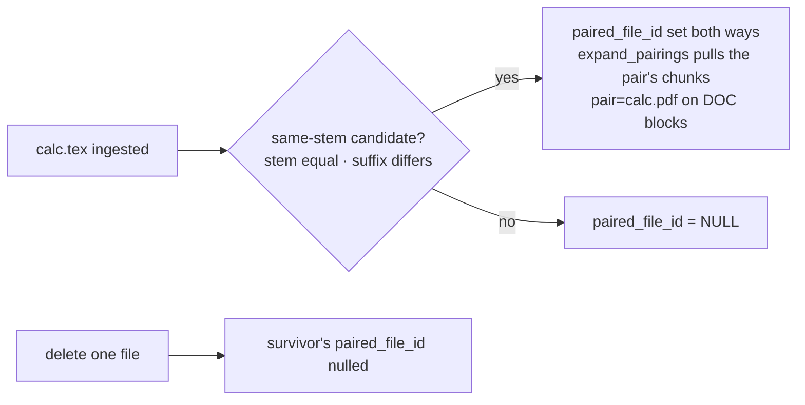
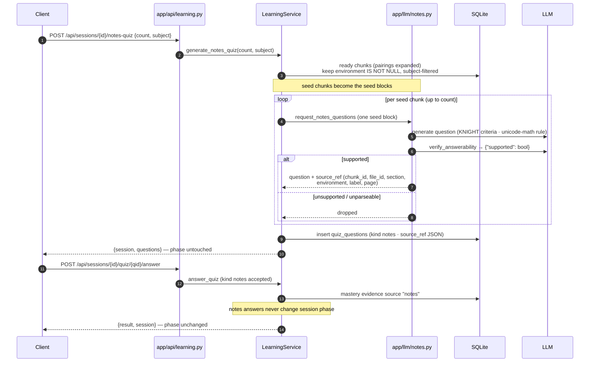

# LaTeX Notes

LaTeX-notes integration: folder watch, same-stem pairing, notes quiz.

```mermaid
flowchart LR
    NOTES["Notes folders (SAGE_WATCH_DIRS)<br/>subject/ subfolders · .tex + .pdf"]
    W["app/services/watcher.py<br/>watcher_loop (lifespan, every SAGE_WATCH_SCAN_SECONDS)<br/>scan_once · sync_watch_sources"]
    FILES[("files")]
    CHUNKS[("chunks")]
    TXT["extraction/tex.py<br/>pylatexenc · sections · environments<br/>display math · preamble macros"]
    FILE_SVC["FileService.ingest_from_disk<br/>subject = first path segment"]

    NOTES -->|"hash each allowed file"| W
    W --> FILE_SVC
    FILE_SVC --> TXT
    TXT --> CHUNKS
    W --> FILES
    NOTES -->|"new / changed / missing"| W
    W -->|"last_scan_at · last_error"| FILES
```

```mermaid
flowchart LR
    A["calc.tex ingested"] --> P{"same-stem candidate?<br/>stem equal · suffix differs"}
    P -->|"yes"| B["paired_file_id set both ways<br/>expand_pairings pulls the pair's chunks<br/>pair=calc.pdf on DOC blocks"]
    P -->|"no"| C["paired_file_id = NULL"]
    D["delete one file"] --> E["survivor's paired_file_id nulled"]
```

```mermaid
sequenceDiagram
    autonumber
    participant C as Client
    participant A as app/api/learning.py
    participant L as LearningService
    participant N as app/llm/notes.py
    participant DB as SQLite
    participant M as LLM

    C->>A: POST /api/sessions/{id}/notes-quiz {count, subject}
    A->>L: generate_notes_quiz(count, subject)
    L->>DB: ready chunks (pairings expanded)<br/>keep environment IS NOT NULL, subject-filtered
    Note over L,N: seed chunks become the seed blocks
    loop per seed chunk (up to count)
        L->>N: request_notes_questions (one seed block)
        N->>M: generate question (KNIGHT criteria · unicode-math rule)
        N->>M: verify_answerability → {"supported": bool}
        alt supported
            N-->>L: question + source_ref (chunk_id, file_id, section,<br/>environment, label, page)
        else unsupported / unparseable
            N-->>L: dropped
        end
    end
    L->>DB: insert quiz_questions (kind notes · source_ref JSON)
    L-->>C: {session, questions} — phase untouched

    C->>A: POST /api/sessions/{id}/quiz/{qid}/answer
    A->>L: answer_quiz (kind notes accepted)
    L->>DB: mastery evidence source "notes"
    Note over L: notes answers never change session phase
    L-->>C: {result, session} — phase unchanged
```

## See also
- [[02-learning-loop|Learning Loop]]
- [[06-data-model-er|Data Model (ER)]]
