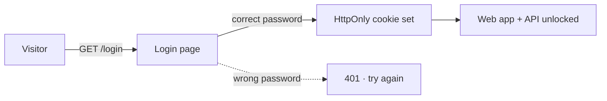

# Security

**Trusted network only.** By default Sage has no authentication; anyone who can
reach the port can use it. Set `SAGE_PASSWORD` (in `.env` or the container
environment) to require a simple password before the app opens: the web UI and
API are gated behind a login screen until the password matches. See
[[environment|Environment]] and [[setup|Setup]].

- The API key stays server-side, never sent to the browser.
- SearXNG, when configured, is queried server-side only.
- The watch API reads only folders inside the configured `SAGE_WATCH_DIRS` bases.
- Study files are untrusted data passed to the model inside `[DOC]` blocks; treated as data, not instructions.

## See also
- [[index|Sage]]