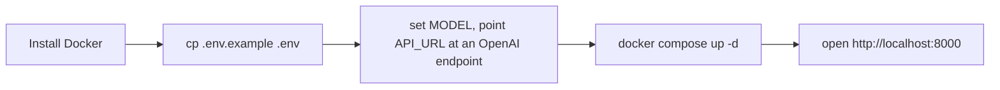

# Setup

Sage runs in Docker anywhere.

1. Install Docker and Compose.
2. `cp .env.example .env`, set `MODEL`. See [[environment|Environment variables]].
3. `docker compose up -d`.
4. Open the UI at `http://localhost:${PORT:-8000}`.

Sage needs an OpenAI-compatible LLM. The compose default targets a local Ollama
container; set `API_URL` to Ollama cloud (`https://ollama.com/v1`) or any other
OpenAI-compatible endpoint instead.

## Access from elsewhere

Over a LAN, open the port in the host firewall and reach Sage at
`http://<host-ip>:8000`; over Tailscale, use its Tailscale IP. Read
[[security|Security]] before exposing it on a network.

## See also
- [[index|Sage]]
- [[environment|Environment variables]]