# Using the web UI

A chat at the port Sage runs on (see [[setup|Setup]]). Start with "teach me X".

```mermaid
flowchart TB
    subgraph A0["Start"]
        A["Open the web UI"] --> B["Type 'teach me X' — optionally attach study files"]
        B --> C["Session created · probe card appears"]
    end
    subgraph A1["Chat"]
        C --> D["Assistant streams the reply — sources cited inline when web search is on"]
        D --> E{"Question with buttons?"}
        E -->|"Yes · No · True · False · Higher/Lower"| F["Tap the button — no typing needed"]
        E -->|"free-text"| G["Type any follow-up question"]
        F --> H["Answered card locks · un-chosen option dims"]
        G --> D
        H --> D
    end
    subgraph A2["Artifacts rail"]
        D --> I["Quizzes & generated diagrams land beside the chat"]
        I --> J["Final quiz renders as interactive cards — select options to answer"]
        J --> K["Answers graded against your mastery"]
    end
    subgraph A3["Resolve"]
        K -->|"mastered"| L["Session complete · summary + read-only history"]
        K -->|"gaps remain"| M["Re-teach missed points then a fresh quiz round"] --> J
    end
    style A0 fill:#191724,stroke:#9ccfd8
    style A1 fill:#191724,stroke:#c4a7e7
    style A2 fill:#191724,stroke:#eb6f92
    style A3 fill:#191724,stroke:#f6c177
```

- Streams answers as they generate; sources cited inline when web search is on.
- Understanding questions render as buttons — tap one.
- Quizzes and diagrams land in a side rail; the chat stays prose.
- Upload a file and it opens the workspace, where the source pane renders the PDF itself (not its raw text).
- The mode toggle (strict / normal) sits in the chat composer on both the home page and the workspace.

The probe and the final quiz are the two question rounds. See
[[02-learning-loop|How Sage teaches]] for the full arc.

## See also
- [[index|Sage]]
- [[security|Security]]