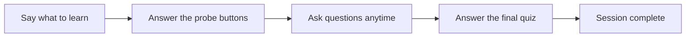

# Using the web UI

A chat at the port Sage runs on (see [[setup|Setup]]). Start with "teach me X".

- Streams answers as they generate; sources cited inline when web search is on.
- Understanding questions render as buttons (Yes/No, True/False, Higher/Lower) — tap one.
- Quizzes and diagrams appear in a side rail; the chat stays prose.

The probe and the final quiz are the two question rounds. See
[[02-learning-loop|How Sage teaches]] for the full arc.

## See also
- [[index|Sage]]
- [[security|Security]]